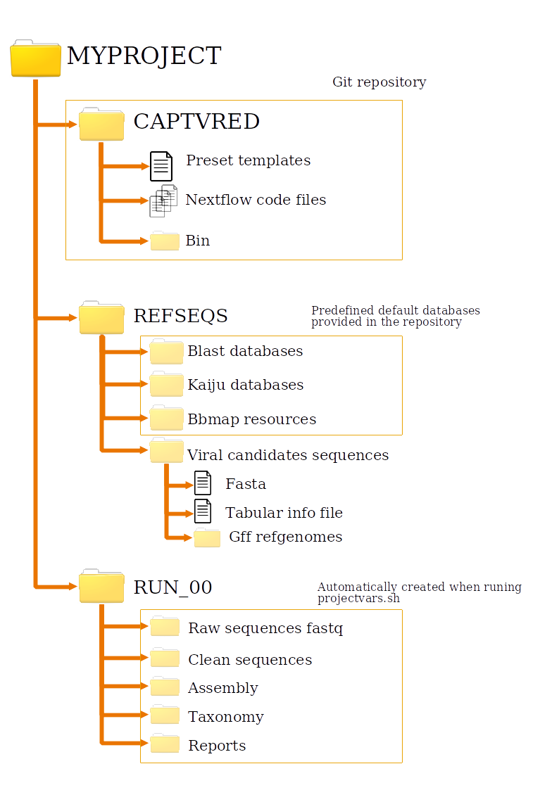

# CONTENTS:
- [Environment set up](#Environment-set-up)
     - [Projectvars file](#Projectvars-file)
    - [Configuration file](#Configuration-file)
     - [Data summary](#Data-summary)
     - [Input data](#Input-data)
     - [Reference sequences](#Reference-sequences)<br /><br />
     - [Data bases](#Data-bases)
- [Running CAPTVRED](#Running-CAPTVRED)
    - [Clone the repository](#Clone-the-repository)
    - [Rerunning](#Rerunning)
    - [All options and parameters](#All-options-and-parameters)<br /><br />
- [Pipeline detailed description](#Pipeline-detailed-description)
<br /><br />
# Environment set up
### Projectvars file

Includes all environment variables necessary to run the pipeline. When 
this script is executed the whole directories filesystem is created.
Every run must have its projectvars.sh inside its base folder.

* Run identifier ($RUNID) is the specific name of the sequencing experiment.  <br />
* $R1 and $R2, which correspond to the pattern used to describe the first and second pair of
files respectively. (see [Input Data section](#input-data))

* Root directory ($RDIR) is the top-level directory of the project.
* Base directory ($BDIR) refers to the root folder where all files created 
in each of the steps in the pipeline will be stored.
* Nextflow directory ($NXFDIR) is the directory of the local CAPTVRED repository.
* Directory that contains the fasta file with the reference sequences and 
the tabular info file ($AMPSQD). The pipeline will create  bowtie and
blast databases and indexes of the fasta in this folder. <br />
* Name of the file containing the amplicon reference sequences ($AMPSQFA).
Bowtie and blast databases will be created with the same prefix name. <br />
* Directory where reference sequences and databases are stored  ($REFSQSD), ant its subdirectories: $BDBD (Blast reference database directory), $AMPSQD (Directory that contains the fasta file of Viral Candidates reference sequences), $KAIDBD(Directory where the kaiju databases are installed).

These variables are set in the _projectvars.sh_ file by the user.
Recommended filesystem structure would be:



After running _projectvars.sh_:
* fastq.gz files must be placed (or linked) to the directory 
"$BDIR/rawseqs_fastq"
* samples_definition.tbl must be placed directly on the $BDIR
* reference sequences (in fa.gz) format must be placed (or linked) in the REFSEQS directory.

### Configuration file:

The configuration file is named *nextflow.config*, you can find it in the workflow main directory. 
It contains the default variables used in each of the steps of the pipeline. 
If you are interested in changing any of the parameters before running the pipeline 
you can:

> **a) Modify the document** <br />
>All parameters can be modified directly on the configuration file. 
Preferably, do not modify the filename keep it in the same directory. 
If you change the filename or directory of the configuration file, or if
you are running the pipeline using the GitHub link, you can provide the name 
of the configuration file as a command line argument using the `-params-file` option.


> **b) Add the parameter as a command line option** <br />
>If you are interested in adjusting only one or a few parameters it might be more
convenient to provide these options directly as command line options. You can do so 
by simply writing: `--ParameterOfInterest NewValue`.
i.e. If you are interested in changing the default number of CPUS to 16 you
can run the pipeline as follows:
>```{.sh}
>nextflow run https://github.com/JosepFAbril/virwaste --NCPUS 16
>```

You can find more information on how to custom and provide the configuration file in the
 [nextflow config documentation](https://www.nextflow.io/docs/latest/config.html) .

### Data summary:

A tabular file containing information about the samples is necessary to 
run the pipeline, only the samples described in this tabular file will 
be analyzed. This file must be named 
"samples_definition.tbl", a template is provided with the repository named "samples_definition_template.sh", and it has the following format:

```
#SAMPLE_ID	   ILLUMINA_ID	   TECHNOLOGY	  PAIRED	 SAMPLE_FACTOR	  METHOD_FACTOR	   DESCRIPTION
R01_C09_G01	   G1_C_S9	       Illumina	    PE	     Bat_guano	      Capture	         Sample 9 description
R01_C10_G02	   G2_C_S10	       Illumina	    PE	     Bat_guano	      Capture	         Sample 10 description
```

Only the first two columns are used in the pipeline, but it is recommended 
to add some metadata information in the tabular file for further data visualizations. <br />
* **Illumina ID** is the identifier given in the sample files and ***corresponds 
exactly to the root of the raw fastq file name***.  <br />
* **Sample ID** corresponds to the sample identifier that will be used in all the pipeline steps. <br />

In the first step of the pipeline (reads cleaning), the names are 
changed in such a way that raw reads keep their original ID while clean reads (and 
everything that comes after) are renamed into de sample ID. If you are not interested in modifying the ids, use the same code in both columns.

### Input data:

All samples must be in fastq.gz format. All of them must be placed in the 
same directory. 

It is assumed that input sequence files are paired files named following
a pattern. The root name for each sample must be described in the [data summary](#data-summary),
and the pattern for the suffix referring to each pair of reads must be described
in the [ *projectvars.sh* file](#projectvarssh-file) ($R1 and $R2 variables).

e.g. if your set of samples is:

```
sample_AA_april_2021_r01.fastq.gz
sample_AA_april_2021_r02.fastq.gz
sample_bb_april_2021_r01.fastq.gz
sample_bb_april_2021_r02.fastq.gz
sample_C_april2021_r01.fastq.gz
sample_C_april2021_r02.fastq.gz
```

Your data summary could be similar to:

```
sample_A    sample_AA_april_2021
sample_B    sample_bb_april_2021
sample_C    sample_C_april2021
```
In this manner, you simplify and standardize the name of the files generated 
all along the pipeline. 

And, finally, you should define the pattern in the projectvars as `R1="_r01"`, since this
is the pattern for the first file of each pair, and `R1="_r02"`, since this
is the pattern for the second file of each pair.


### Viral candidates reference sequences

__Tabular info file__ <br />
Descriptive tabular file including the NCBI Id, full name, short name and 
taxon ID for each of the reference sequences in the reference set.  

    Camps are: Family, Specie, Host, SeqID, Region, Size, Name, Description


__Fasta file__  <br />
Fasta file containing the reference sequences of the Viral Candidates. Identifier must be the NCBI ID 
and optionally other information (separated with a space!). 
These sequences will be used as a reference database for alignments (performed 
with bowtie for the reads and blast for the contigs) and for the taxonomic 
classification (see "Kaiju databases"  subsection).


__GFF files__ <br />
A separate GFF file for each of the viral candidates must be stored in the "gff_refgenomes" directory, those will be used to graphically visualize the alignments and coverage of each genome.

### Databases
__Kaiju Databases__ <br />
Taxonomic classification with kaiju is performed by default using the ***rvdb*** database, and ***nr_euk*** is used for the filtering step. Both are provided ready to use in this [tar.gz file](https://compgen.bio.ub.edu/datasets/CAPTVRED/REFSEQS.tar.gz).
However, it can be changed to any other set of sequences. "nr_euk", "refseq" and "viruses" databases, which are provided ready to use in the [kaiju materials website](https://bioinformatics-centre.github.io/kaiju/downloads.html), or even a customized database can be set up (for more information see [Kaiju documentation](https://github.com/bioinformatics-centre/kaiju?tab=readme-ov-file#custom-database)).


If you with to use a different database for kaiju you need to download them and place (or link) the file in the reference sequences directory. The following options must be added to the command:
* Changing the database used for the taxonomic classification step (viral assignments): 
``` --params.kaijudb  "database_name" ``` (Please, note that kaiju is not the default approach for the taxonomic classification, if you with to use this algorithm you should enable ```--params.taxalg KAIJU``` as well.)

* Modify the database used for the filtering step (dircarding non-viral sequences): 
``` --params.kaijuDBRAW  "database_name" ```<br />

__Blast Databases__ <br />

If the filtering step is performed using blastn (default) or tblastx, the default database is ***RVDB***. 
If you with to use a different database for either blastn or tblastx you need to download them and place (or link) the file in the reference sequences directory. When running the pipeline, the ``` --params.blast_ref_db_name "database_name" ``` option must be added to the command line. (If you are interested in using tblastx approach, please note that it is not the default approach for the taxonomic classification, if you with to use this algorithm you should enable ```--params.taxalg TBLASTX``` as well.)


__Bbmap resources__
For the cleanning step performed with bbduk, the sequences of the adapters are required. Those can be linked directly to the bbmap location. However, in the [tar.gz file](https://compgen.bio.ub.edu/datasets/CAPTVRED/REFSEQS.tar.gz) provided the fasta file as well.


# Running CAPTVRED
### Clone the repository

Clone the repository from GitHub
Running command with default workflow and parametes will be:

```{.sh}
nextflow run CAPTVRED [optional parameters] -with-report $RPTDR/Nextflow_execution_report.html
```

### Rerunning
If the pipeline crashes at some point, after solving the probrem the execution can be resumed from the last cached results by using the argument *-resume*.

```{.sh}
nextflow run CAPTVRED [optional parameters] -with-report $RPTDR/Nextflow_execution_report.html -resume
```

### All options and parameters


# Pipeline detailed description 

### Quality:

Reads quality is performed at four different stages during the pipeline, 
(1) in the raw reads (before any manipulation of the data), (2) in the 
clean reads (after the cleaning step) and (3) in the filtered reads (after discarding 
non-viral reads). [FastQC](https://www.bioinformatics.babraham.ac.uk/projects/fastqc/) 
is run with default parameters. In all three 
cases, the quality assessment is performed using FastQC individually for 
each file. All FastQC reports in the run are summarized in 
a single report using [multiQC](https://multiqc.info/)(v1.9). 
MultiQC is also used to summarize the bam files quality after the alignment of
the reads into the reference sequences using bowtie (see section 2.3).
In both cases, MultiQC is run with default parameters. The final _html_ 
reports are copied to the reports directory for the final data visualization.

No parameters can be modified in the quality stage of the pipeline.

More information:
* [FastQC](https://www.bioinformatics.babraham.ac.uk/projects/fastqc/) 
* [MultiQC](https://multiqc.info/)

### Cleaning

Reads cleaning is performed using 
[BBDuk(BBMap version 38.96)](https://jgi.doe.gov/data-and-tools/software-tools/bbtools/bb-tools-user-guide/bbduk-guide/), 
it takes the paired files and processes them (always coupled), and it outputs 
a pair of mated files (with the suffix *_pe1* and *_pe2* respectively) 
and also a singletons file (with the suffix *_sgl*). As mentioned above, 
the quality of these files is subsequently assessed with FastQC and MulitQC programs. 

All output files (paired and singleton fastq compressed files and quality 
reports) are saved in the `$BDIR/cleanseqs` directory.

At this point, the reads identifiers are translated from the Illumina ID to
the sample ID (see [data summary section](#data-summary)).

**READS CLEANING PARAMETERS**

* `params.bbdukREF`

By default, the reference file used in the cleaning step contains the reference
Illumina adapters and is given as a BBDUK resource. If you use a different 
technology and/or adapters, provide them in a comma-separated 
file.  

* `params.bbdukMINLEN`

Reads shorter than this after trimming will be discarded, BBDuk uses 10 by
default, in this pipeline the minlength is set to 32. 

* `params.bbduqMAQ`

Minimum average quality, reads with average quality (after trimming) below 
this will be discarded. BBDuk, by default has no threshold value (maq=0), 
in this pipeline, it is set to 10.

(Remember that you can [modify any of the parameters](#configuration-file) 
in the config file or directly from the command line.)

More information: [BBDUK guide](https://jgi.doe.gov/data-and-tools/software-tools/bbtools/bb-tools-user-guide/bbduk-guide/)


### Filter and discard non-viral reads

Before mapping or assembling steps, we try to discard reads identified as
non-viral species (such as eukaryotic, archaea, or bacterial DNA). To do so, 
a taxonomical classification is performed using [Kaiju](https://kaiju.binf.ku.dk/)(v.1.9.0).
Paired and single reads are assigned to a taxonomic group separately and,
later, merged in the same file to generate a tab-separated summary and a 
krona plot in HTML format (you can find these files in `$BDIR/taxonomy/kaiju/"sample_ID"/reads_taxon` directory). 
All reads assigned to non-viral are discarded (using seqkit v.0.15.0) and a new set of FASTQ files 
is saved in the `$BDIR/cleaneqs` directory with the suffix `*.filtered.fastq.gz`). As mentioned above, 
the quality of these files is subsequently assessed with FastQC and MulitQC programs. 

**KAIJU (ON READS) PARAMETERS**

* `.params.kaijuDBRAW`:

The reference database is used to assign a taxonomic range to the reads. By 
default it is used *nr_euk* database, it can be changed by *refseq* or even by
a customized one. You can find more information about different databases in 
the [kaiju GitHub repository](https://github.com/bioinformatics-centre/kaiju).

* `params.kaijuMAX_FORKS`, `params.kaijuMAX_RETRIES` and `params.kaijuNCPUS`:

Kaiju is the higher resource-consuming program in the pipeline, when 
running too many kaiju processes in parallel the pipeline may crash, 
to avoid so, specific parallelization parameters are set for the kaju in both reads taxonomy and 
[contigs taxonomy](#taxonomic-classification). `kaijuMAX_FORKS` 
refers to the  maximum number of process instances that can be executed 
in parallel, it is set by default to 4. `kaijuNCPUS` refers to the maximum
number of CPUs used in this process, it is set to 26 by default. The error 
strategy is set to "retry" up to 2 times ( `kaijuMAX_RETRIES`). You can find more information about 
directives on [this page of the Nextflow documentation](https://www.nextflow.io/docs/latest/process.html#directives).

(Remember that you can [modify any of the parameters](#configuration-file) 
in the config file or directly from the command line.)

More information: 
* Kaiju [documentation](https://kaiju.binf.ku.dk/) and 
[github repository](https://github.com/bioinformatics-centre/kaiju).
* Seqkit [documentation](https://bioinf.shenwei.me/seqkit/)


### Reads assembly:

The final set of reads is assembled into contigs for the further taxonomic
analysis. 

**ASSEMBLY PARAMETERS**

* `params.assembler`:

This pipeline is developed to support two assemblers: MEGAHIT and TRINITY.
By default the assembly is performed using megahit, which is notably faster 
and less resource-consuming.

\*CONSIDERATIONS ON TRINNIY ASSEMBLER:  Trinity is a highly resource-consuming
program and requires a higher number of reads than other programs to assemble a contig.
For this reason, the maximum memory allowed for this  is this option is 250G (you 
can modify this using the parameter *`params.trinityMAXM`*. To avoid the 
crash of the whole pipeline in the cases when the program is not able to 
assembly any contig an exception handler has been added to the trinity module; 
if this happens nextflow will raise a warning, for any further information 
you will have to look over the log files. Please take into account that this pipeline
has been developed to work with environmental samples (from cities sewage), 
the DNA may be degraded and in some cases trinity may not be able to 
assembly any contig.*

* `params.megahit_errorHandler`:
This parameter allows the user to add an error handler in the case that 
megahit crashes. This might happen when the program is not able to 
assemble any reads, especially in negative controls or degraded samples.
To avoid this, the error handling strategy can be changed to 'ignore' 
in the configuration file or directly as a CL option.


* `params.assemblyMINCONLEN`:

No contigs shorter than this number will be assembled. The same parameter
is valid either for megahit or trinity assemblers. Considering the read
lengths and the origin of the samples, by default, the minimum contig 
length is set to 100.
After assembling the contigs, the reads are aligned using the contigs
set as reference (In this case parameters are --end-to-end --fast) using 
bowtie and samtools. All sequences longer than 100nt that do not align 
to any contig, are considered singletons and added to the final assembly.


More information: 
* [Trinity documentation](https://github.com/trinityrnaseq/trinityrnaseq/wiki)
* [Megahit documentation](https://github.com/voutcn/megahit)


### Taxonomic classification: 

#### Nucleotide-level classification:
#### Protein-level classification:

### Reads alignment on reference sequences:

The final set of contigs is aligned against the set of reference sequences (the
ones used to design the capture probes) to see which species were found 
and what is the coverage. The alignment is performed using the 
[bowtie2 software (v.2.4.2)]((http://bowtie-bio.sourceforge.net/bowtie2/manual.shtml)) 
and after [samtools (v.1.1)](http://www.htslib.org/doc/samtools.html) is used to 
discard unmapped and low quality reads. This step is performed
separately in paired ends reads and single-end reads with the same exact parameters.
The bowtie is run always with the *end-to-end* alignment mode and *sensitive* 
presets, these parameters cannot be modified in this pipeline since many 
false positives and/or low-quality hits have been detected with any other approach. 


**ALIGNMENT PARAMETERS**

* `params.alignMINQ`
This parameter refers to the minimum acceptable quality (in phred score format) 
of the aligned reads when filtering with *samtools*. By default, it is set 
to 13 (Q=13), which is translated in an error probability of 0.05 
 or a 95% of accuracy.
<!--
(E=10<sup>{-0.1}Q<sup>=10<sup>{-1.3}<sup>=0.05)
-->

More information: 
* [Bowtie documentation](http://bowtie-bio.sourceforge.net/bowtie2/manual.shtml)
* [Samtools manual](http://www.htslib.org/doc/samtools.html)

<!--
## Figures

**Mapped reads summary**
**Coverage Figures**
-->

### Files in the repository:
In the Nextflow repository for the CAPTVRED pipeline, one can find the following files:
* projectvars.sh: &rarr; this file is not part of the nextflow environment, it is used to set the local directories before launching nextflow.
* nextflow.config : &rarr; Environment variables. This file is the same for all the runs. This file is read by default by nextflow (it must be placed in the project directory or the base directory).
* main.nf : &rarr; Controls workflow


Nextflow Modules:
* rawfq_clean.nf &rarr; BBDuk implementation for reads cleanning
* seq_stats.nf &rarr; fastQC and  MultiQC implementation. These quality control programs are run at different points in the workflow to keep track of the data quality. 
* reads_align.nf &rarr; Bowtie processes: create an index and run the alignment.
* reads_assembly.nf &rarr; megahit, trinity and spades
* contigs_align.nf &rarr; blast processes: prepare the database and run the alignment.
* contigs_taxonomy.nf &rarr; Taxonomic analysis of assembled contigs using kaiju.


# Dependencies:


* FastQC v0.11.9
* MultiQC v1.9
* BBMap v.38.96
* Kaiju v.1.9.0
* Bowtie2 v.2.4.2
* samtools v.1.11
* htslib v.1.11-4


<!--
Compiling commands:

* MARKDOWN TO HTML

pandoc --from=gfm --to=html --output=readme_DOCUMENTATION_virwaste.html readme_DOCUMENTATION_virwaste.md

* MARKDOWN TO PDF

pandoc --from=gfm --to=latex                          \
       --template=template_de_la_maria.tex            \
       --variable=papersize:a4 --variable=toc:true    \
       --number-section                               \
       --output=readme_DOCUMENTATION_virwaste.tex     \
       readme_DOCUMENTATION_virwaste.md

pdflatex readme_DOCUMENTATION_virwaste.tex

-->
